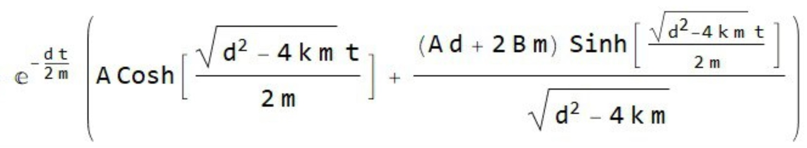

# Аналитические решения колебательных систем

## 1. Колебания пружины (без затухания)

Уравнение движения:
```
m(d²x/dt²) + kx = 0
```

Общее решение:
```
x(t) = A*cos(ωt) + B*sin(ωt)
```
где:
- ω = √(k/m) - собственная частота колебаний
- A - начальное смещение x(0)
- B - начальная скорость v(0)/ω
- k - коэффициент жесткости пружины
- m - масса груза

## 2. Колебания пружины с демпфером

Уравнение движения:
```
m(d²x/dt²) + dx' + kx = 0
```

Общее решение:



где:
- d - коэффициент демпфирования
- k - коэффициент жесткости пружины
- m - масса груза
- A - начальное смещение
- B - начальная скорость

## 3. Система связанных колебаний двух масс

Введём силы взаимодействия между массами:
```
F₁₂ + k₁₂(x₁ - x₂) + d₁₂(x₁ - x₂) = 0
F₂₁ = -F₁₂
```

Система уравнений движения:
```
m₁(d²x₁/dt²) + d₁x₁' + k₁x₁ - F₁₂ = 0
m₂(d²x₂/dt²) + d₂x₂' + k₂x₂ + F₁₂ = 0
```

где:
- m₁, m₂ — массы грузов
- k₁, k₂ — коэффициенты жесткости пружин
- d₁, d₂ — коэффициенты демпфирования
- k_{s2} — коэффициент жесткости связи между массами
- d_{s2} — коэффициент демпфирования связи между массами
- x₁, x₂ — смещения грузов от положения равновесия
- F_{12}, F_{21} — силы взаимодействия между массами
